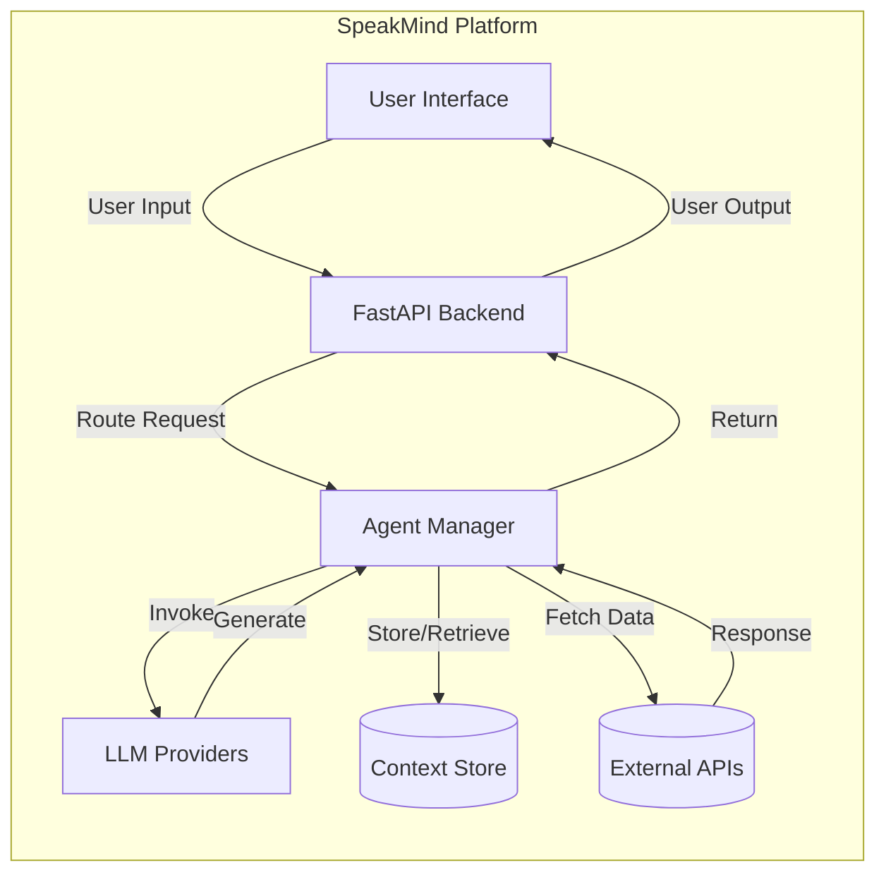

[]()

# SpeakMind

An advanced conversational AI tool inspired by ChatGPT, built for context-aware and intuitive interactions.

> **Status:** 🔄 In Development  
>
> ```text
> [█-------------------] 5% Complete
> ```

---

## 🚀 Features

- **Multi-turn Conversations:** Seamless back-and-forth dialogue management.
- **Context Awareness:** Maintains session state for coherent responses.
- **Prompt Engineering:** Customizable prompts for tailored outputs.
- **API Integrations:** Real-time data retrieval from external services.
- **Scalable Design:** Containerized architecture ready for cloud deployment.

---

## 🧰 Tech Stack

### Languages
- Python 3.9+

### Frameworks & Libraries
- **PyTorch** & **TensorFlow** – Deep learning
- **Hugging Face Transformers** – LLMs
- **LangChain** – Agent orchestration
- **FastAPI** – Backend APIs
- **Streamlit** – Rapid UI prototyping

### Infrastructure & Tools
- **Docker** & **Kubernetes** – Containerization & orchestration
- **AWS / Azure / GCP** – Scalable cloud deployments
- **Git** – Version control

---

## 📈 Architecture



---

## 🔧 Installation & Setup

1. **Clone the repository**

   ```bash
   git clone https://github.com/your-username/SpeakMind-.git
   cd SpeakMind-
   ```

2. **Create a virtual environment**

   ```bash
   python -m venv venv
   source venv/bin/activate  # On Windows use `venv\\Scripts\\activate`
   ```

3. **Install dependencies**

   ```bash
   pip install -r requirements.txt
   ```

4. **Start development server**

   ```bash
   uvicorn app.main:app --reload
   ```

---

## 🤝 Contributing

1. Fork the repository  
2. Create a feature branch:  
   ```bash
   git checkout -b feature-name
   ```
3. Commit your changes:  
   ```bash
   git commit -m "Add some feature"
   ```
4. Push to the branch:  
   ```bash
   git push origin feature-name
   ```
5. Open a pull request

---

## 📄 License

This project is licensed under the **MIT License**. See [LICENSE](LICENSE) for details.

---

*Thank you for helping shape the future of conversational AI with SpeakMind!*
