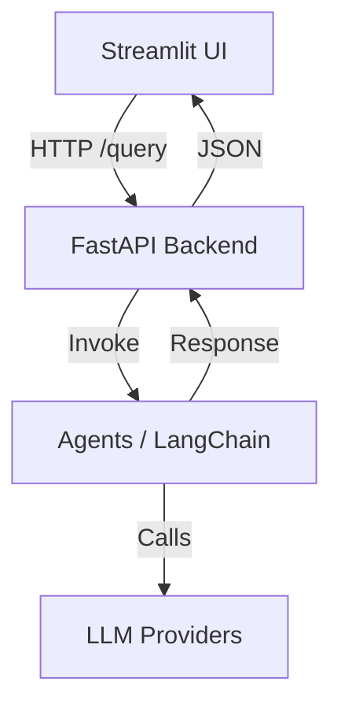

[]()

# SpeakMind

An advanced conversational AI assistant inspired by ChatGPT — built for **context‑aware, multi‑turn interactions** with a clean Streamlit UI and a FastAPI backend.

<p align="center">
  
</p>

> **Status:** 🔄 In Development
>
> ```text
> [██------------------] 10% Complete
> ```

---

## 🚀 Features

* **Multi‑turn Conversations** with session memory (mock + real LLM modes)
* **Configurable System Prompt** from the UI
* **FastAPI Backend** exposing `/` (health) and `/query` endpoints
* **Streamlit Frontend** with retry-on-failure and connection status
* **Modular Agents** (LangChain powered; extendable tools)
* **Container‑ready** (easy path to Docker + cloud)

---

## 🧰 Tech Stack

**Python 3.9+**

**Frameworks & Libraries**

* FastAPI, Uvicorn
* Streamlit, Requests
* LangChain (+ tools)
* (Optional) OpenAI / Together.ai SDKs

**Infra & Tooling**

* Docker (optional)
* Render / Railway / Fly.io (FastAPI)
* Streamlit Cloud (Streamlit)

---

## 🗂️ Repository Structure

```
SpeakMind/
├─ ai_agent.py          # Simple Together/OpenAI agent (CLI helper)
├─ app_ui.py            # Streamlit UI (frontend)
├─ app.py               # FastAPI backend (real API)
├─ config.py            # Config + env variables
├─ mock_backend.py      # Mock FastAPI server (no API keys required)
├─ multi_agent.py       # LangChain multi‑agent CLI demo
├─ requirements.txt     # Python dependencies
├─ assets/              # 📸 Screenshots & images for README
│  └─ ui_screenshot.png
└─ README.md
```

---

## 📈 Architecture



---

## 🔧 Setup & Run (Local)

### 1) Create & activate venv

```bash
python -m venv venv
# Windows
venv\Scripts\activate
# macOS/Linux
# source venv/bin/activate
```

### 2) Install dependencies

```bash
python -m pip install --upgrade pip
python -m pip install -r requirements.txt
```

### 3) (Optional) Configure API keys

Create a `.env` file in the repo root if you’ll use real LLMs:

```
OPENAI_API_KEY=sk-...
TOGETHER_API_KEY=...
```

### 4a) **Mock mode** (no keys needed)

Run the mock backend:

```bash
python mock_backend.py
# → serves at http://127.0.0.1:9000
```

Then start the UI in a new terminal:

```bash
streamlit run app_ui.py
# → http://localhost:8501
```

### 4b) **Real backend** (FastAPI)

Run FastAPI instead of the mock:

```bash
uvicorn app:app --host 127.0.0.1 --port 9000 --reload
```

Then start the UI:

```bash
streamlit run app_ui.py
```

> The UI calls the backend at `http://127.0.0.1:9000`. To target a deployed API, update the base URL inside `app_ui.py`.

---

## 🔌 API Endpoints (FastAPI)

* `GET /` → health: `{ "message": "..." }`
* `GET /query?query=...&prompt=...` → returns `{ "response": "..." }`

**cURL:**

```bash
curl "http://127.0.0.1:9000/query?query=Hello&prompt=You%20are%20helpful"
```

---

## ☁️ Deployment (Free‑friendly)

You can deploy **frontend and backend separately**:

### Streamlit (frontend)

* **Streamlit Cloud** → connect GitHub → main file: `app_ui.py`

### FastAPI (backend)

* **Render** (free web service) / **Railway** / **Deta Space** / **Fly.io**
* Start command: `uvicorn app:app --host 0.0.0.0 --port 10000` (or platform’s port)

### Point the UI to your backend

In `app_ui.py`, replace the base URL:

```python
# Example
BASE_URL = "https://speakmind-backend.onrender.com"
```

### CORS for cross‑origin calls

Add this to `app.py`:

```python
from fastapi.middleware.cors import CORSMiddleware

app.add_middleware(
    CORSMiddleware,
    allow_origins=["*"],  # tighten to your Streamlit domain in prod
    allow_credentials=True,
    allow_methods=["*"],
    allow_headers=["*"],
)
```

---

## 🤝 Contributing

1. Fork the repo
2. Create a feature branch: `git checkout -b feature-name`
3. Commit: `git commit -m "feat: add <feature>"`
4. Push: `git push origin feature-name`
5. Open a Pull Request

---

## 🧭 Roadmap

* [ ] Vector memory (FAISS) for long‑term conversation
* [ ] Tooling: web search, docs RAG, calculators
* [ ] Docker + docker‑compose for one‑command local stack
* [ ] CI (lint/test) & pre‑commit hooks
* [ ] Auth + rate limiting

---

## 📄 License

MIT — see [LICENSE](LICENSE).
